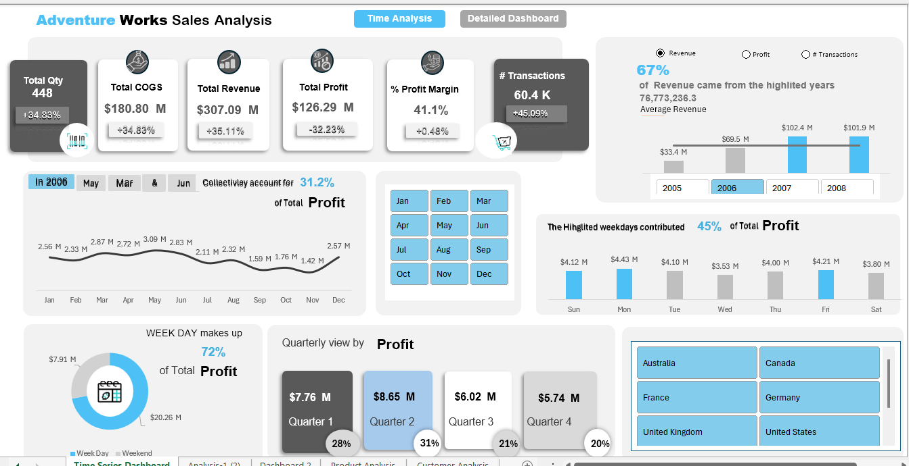
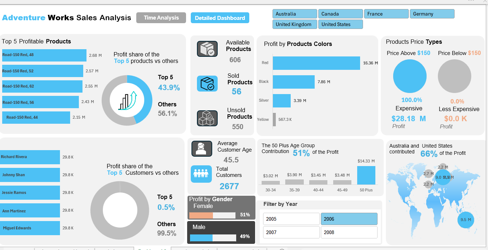

# Adventure Works Sales Analysis Dashboard

This repository contains a comprehensive sales analysis dashboard for the Adventure Works sample database, built using **Microsoft Excel**.

## Dashboard Previews

The solution features two main views: a **Detailed Dashboard** for deep-dive analysis and a **Time Analysis** dashboard for tracking performance trends.

**Time Analysis View**

**Detailed Dashboard View**

## Key Features & Insights

*   **Dual-Dashboard Design:** The project is split into two distinct reports:
    1.  **Detailed Dashboard:** Focuses on product, customer, and demographic analysis. It answers questions like "Who are our most profitable customers?" and "Which product attributes drive sales?"
    2.  **Time Analysis:** Focuses on year-over-year (YoY) performance, seasonality, and quarterly trends.

*   **Actionable Insights:** The dashboard uncovers insights, such as:
    *   The **50 Plus age group** is a key demographic, contributing **51%** of the total profit.
    *   The top 5 most profitable products account for **43.9%** of the profit, while the top 5 customers account for only **0.5%**, indicating a very broad customer base.
    *   Weekdays are responsible for **72%** of the total profit.

*   **Interactive Experience:** The dashboard is fully interactive, with slicers for **Country**, **Year**, and **Month**, allowing users to dynamically filter the data and explore insights on their own.

## Technology Stack

*   **Microsoft Excel:** The primary tool used for data modeling, visualization, and dashboard creation.
*   **DAX (Data Analysis Expressions):** Used to create the complex measures and KPIs that power the dashboard's calculations (e.g., Profit Margin, YoY Growth).

